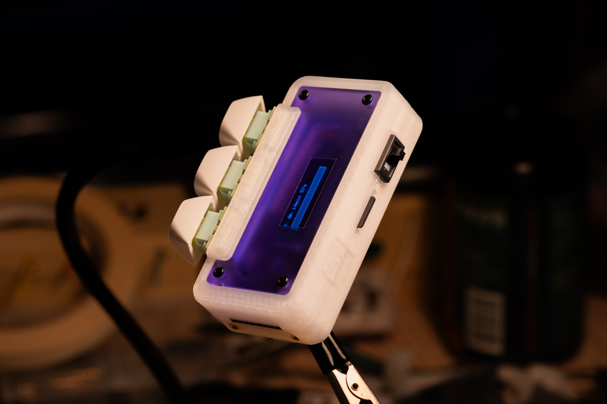
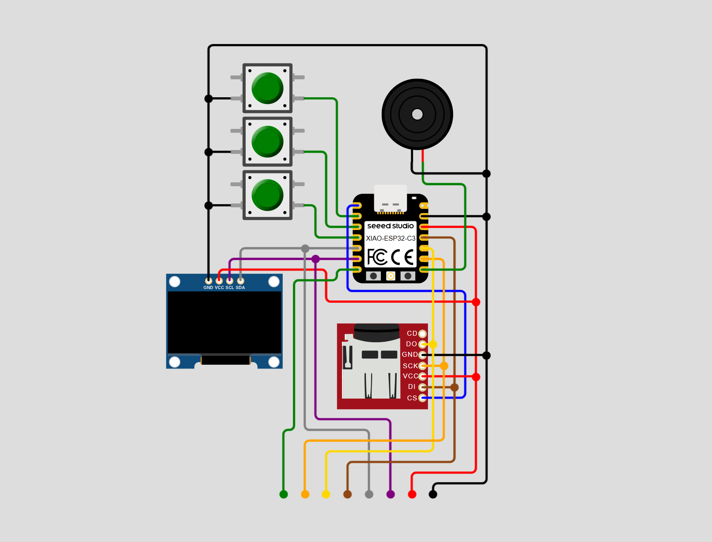

# Data Gadget

## Intro
This is a CCI course project. This is a portable device for logging data.

This project currently focuses on self tracking behaviors and habits. The device can be used as a timer and counter. The logged data will be stored in the Micro SD card, and can be connected to a Chrome based browser via Bluetooth to visualize the recorded data. In addition, this device has a rich set of interfaces available: I2C, SPI, and hardware RX. This provides the possibility of expanding more functions.

## Repositorie structure
+ DataGadget_ArduinoIDE/main
  
  The archived version. Using ArduinoIDE as the compile and upload methord. There were an environment configuration problem in PlatformIO for a while that prevented the code from being compiled correctly.
+ DataGadget_PlatformIO
	+ DataGadget_PlatformIO/lib
   
		Custom libraries.
	+ DataGadget_PlatformIO/src
   
		Main code for Arduino.
+ DataWeb
  
	Code and 3D resources for web visualization APP.
+ Image
  
	Images and diagram.

## Circuit Diagram

The device uses Seeed Xiao ESP32-C3. It is connected to 3 switches, a 0.91" OLED display, a micro SD card reader, and a vibration motor. The main inputs are three buttons, and since the connected pins capable of reading analog signals, the inputs can also be replaced with potentiometers to get more diverse input methods. The main feedback of the device are the OLED display and the vibration. The vibration motor is detachable, so it can also be replaced with other component.

## License

<a property="dct:title" rel="cc:attributionURL" href="https://github.com/Zippedp/DataGadget">DataGadget</a> by Zeyu Jiao is licensed under <a href="https://creativecommons.org/licenses/by-nc-sa/4.0/?ref=chooser-v1" target="_blank" rel="license noopener noreferrer" style="display:inline-block;">CC BY-NC-SA 4.0 </a>

